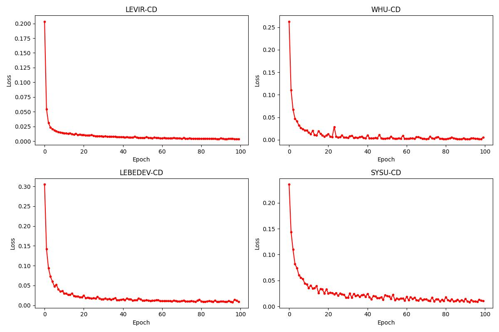

## DEAR-Net
DEAR-Net: A Deep Edge-Aware Multi-Attention Fusion Refinement Network for Change Detection 


### Backbone

The released code includes implementations with different backbones as described in the paper, and can be switched as needed.


### Datasets 
1. **LEVIR:** H. Chen and Z. Shi, “A spatial-temporal attention-based method and a new dataset for remote sensing image change detection,” *Remote Sens*, vol. 12, no. 10, p. 1662, May. 2020. (URL: [A Spatial-Temporal Attention-Based Method and a New Dataset for Remote Sensing Image Change Detection](https://www.mdpi.com/2072-4292/12/10/1662))

2. **WHU:** S. Ji, S. Wei, and M. Lu, “Fully convolutional networks for multisource building extraction from an open aerial and satellite imagery data set,” *IEEE Trans. Geosci. Remote Sens*, vol. 57, no. 1, pp. 574-586, Aug. 2019. (URL: [Fully Convolutional Networks for Multisource Building Extraction From an Open Aerial and Satellite Imagery Data Set | IEEE Journals & Magazine | IEEE Xplore](https://ieeexplore.ieee.org/document/8444434))

3. **Lebedev:** M. A. Lebedev, Y. V. Vizilter, O. V. Vygolov, V. A. Knyaz, and A. Y. Rubis, “Change detection in remote sensing images using conditional adversarial networks," *Int. Arch. Photogramm. Remote Sens. Spatial Inf. Sci.*, vol. XLII-2, pp. 565-571, May. 2018. (URL: [ISPRS-Archives - CHANGE DETECTION IN REMOTE SENSING IMAGES USING CONDITIONAL ADVERSARIAL NETWORKS](https://isprs-archives.copernicus.org/articles/XLII-2/565/2018/))

4. **SYSU-CD:** Q. Shi et al., “A deeply supervised attention metric-based network and an open aerial image dataset for remote sensing change detection,” IEEE Trans. Geosci. Remote Sens., vol. 60, pp. 1-16, 2022. (URL：[DSAMNet: A Deeply Supervised Attention Metric Based Network for Change Detection of High-Resolution Images | IEEE Conference Publication | IEEE Xplore](https://ieeexplore.ieee.org/abstract/document/9555146))


------

#### Data

```
Data/
├── train/
│   ├── images/
│   │   ├── t1/
│   │   └── t2/
│   └── label/
├── val/
│   ├── images/
│   │   ├── t1/
│   │   └── t2/
│   └── label/
└── test/
    ├── images/
    │   ├── t1/
    │   └── t2/
    └── label/
```

### Comparative Experimental Models 

1. **FC-EF、FC-EF-Conc、FC-EF-Diff:** "Fully convolutional siamese networks for change detection" Code: https://github.com/rcdaudt/fully_convolutional_change_detection
2. **IF-Net:** "A deeply supervised image fusion network for change detection in high resolution bi-temporal remote sensing images" Code: https://github.com/GeoZcx/A-deeply-supervised-image-fusion-network-for-change-detection-in-remote-sensing-images
3. **LGP-Net:** "Building change detection for VHR remote sensing images via local–global pyramid network and cross-task transfer learning strategy" Code: https://github.com/TongfeiLiu/LGPNet-for-building-CD
4. **GAS-Net:** "Global-aware siamese network for change detection on remote sensing images" Code: https://github.com/xiaoxiangAQ/GAS-Net
5. **MAFG-Net:** "Multiscale attention fusion graph network for remote sensing building change detection" Code:  https://github.com/ShangGY805/MAFG
6. **RFA-Net:** "Robust feature aggregation network for lightweight and effective remote sensing image change detection" Code: https://github.com/Youzhihui/RFANet
7. **DCIL-Net:** "Dual-branch cross-resolution interaction learning network for change detection at different resolutions" Code: https://github.com/Li738/DCILNet
8. **MambaBCD:** "ChangeMamba: Remote sensing change detection with spatiotemporal state space model" Code: https://github.com/ChenHongruixuan/ChangeMamba
9. **CDMamba:** "CDMamba: Incorporating local clues into Mamba for remote sensing image binary change detection" Code: https://github.com/zmoka-zht/CDMamba
10. **TSMS-Net:** "A two-stage multiscale network for high-resolution remote sensing images change detection" Code: https://github.com/xbddl/TSMSNet
11. **TMSF-Net:** "A novel transformer-based multiscale siamese framework for high-resolution remote sensing change detection" Code: https://github.com/ljwang8/TMSF


### Loss Curve




### backbone weights 
1. **pvt_v2：** https://pan.baidu.com/s/1Z6HbSse1E_dPE3Uod0RK5g  Code: 5588

2. **pvt_v1**: https://pan.baidu.com/s/1epmWqzkeptbeqBiEXndGaQ?pwd=8p4b  Code: 8p4b 

3. **mambavision:** https://pan.baidu.com/s/1FBDyJDoNgXSB8Kax_dcsDQ?pwd=255t Code: 255t 
